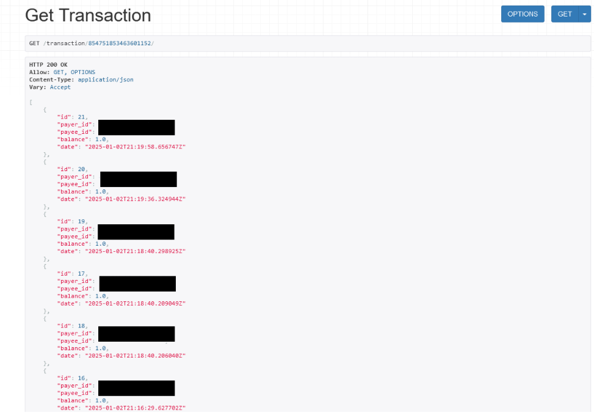

# economyBOT

economyBOT is Unbelievaboat clone coded in *discord.py*, with couple 
benefits. You can earn money via `/work` command, store in bank 
or idk. 

**We stopped working on that bot !**
Working on new projects, similar to economyBOT, and we burnout with that bot tbh 
## How its look ?





## Authors

- Me
- KacpZbyDev 

## Commands
```python
/bal - Check your balance
/createwallet - Create wallet to start earning money
/leaderboard - Check 20 most richest mf
/help - List of all commands 
/pay - Pay money to someone
/shop-list - Display items in shop
/transactions - Check your transactions
/work - Earn money
```

## How to install 

```python
1. Install packages from requirements.txt
~ pip install -r /path/to/requirements.txt

2. Install PostgresSQL

3. Create DB User and database:
~ CREATE DATABASE yourdbname;
~ CREATE USER youruser WITH ENCRYPTED PASSWORD 'yourpass';  
~ GRANT ALL PRIVILEGES ON DATABASE yourdbname TO youruser

4. Create Discord bot via Discord Developer Portal 

5. Create .env file and put this informations
TOKEN= - Discord bot Token
SECRET_KEY= - Django Secret Key
DB_NAME= - Database Name
DB_USER= - Database User
DB_PASSWORD= - Database User Password

6. Paste and run this SQL code
~ https://ntpd.eu/oVqwG

7. Run project
~ python run.py
```

